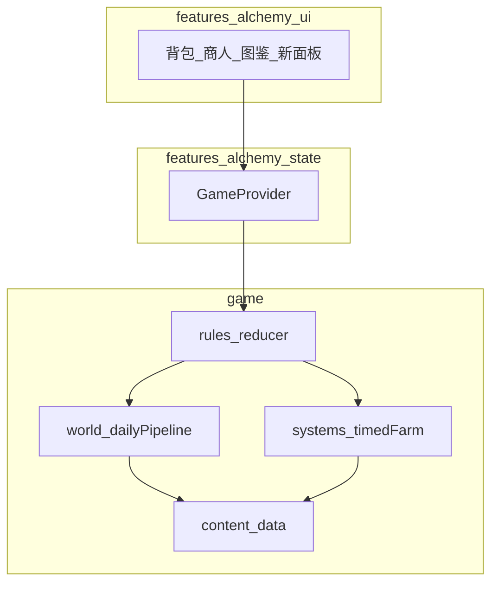

# 云端炼金：目录整理、Pencil UI 与玩法扩展工作计划

## 现状锚点

- 核心状态见 [`src/game/types.ts`](d:\代码玩具测试\cloud-alchemy\src\game\types.ts)：`GameState` 仅有 `inventory`、`discovered`、`discoveredRecipes`、`day`、`merchantOffers`、`lastSynthesis`。
- 过天逻辑见 [`src/game/rules/reducer.ts`](d:\代码玩具测试\cloud-alchemy\src\game\rules\reducer.ts)：`NEXT_DAY` 仅 `day++` 并调用 [`generateMerchantOffers`](d:\代码玩具测试\cloud-alchemy\src\game\rules\merchant.ts)。
- UI 集中在 [`src/features/alchemy/ui/`](d:\代码玩具测试\cloud-alchemy\src\features\alchemy\ui) 与 [`src/index.css`](d:\代码玩具测试\cloud-alchemy\src\index.css)。

---

## 一、文件层级整理（「打包」成更清晰模块）

目标：把**模拟层 / 内容数据 / UI 壳**边界写进目录名，减少 `game/rules` 无限膨胀。

建议落地结构（单仓、仍用 `@/*` 别名，不强制 npm workspace 子包）：

```text
src/
  app/                          # 根布局（已有）
  features/alchemy/
    ui/                         # 页面级组件（背包、商人、图鉴、事件条、田地等）
    state/                      # GameProvider（已有）
    # 可选：styles/             # 从 index.css 按区块拆出 alchemy-layout.css、events.css（与 Pencil 产出对齐）
  game/
    types.ts                    # 扩展 GameState 子结构或拆分为 WorldState 等
    content/                    # items、recipes、Zod（已有）
    content/events.ts           # 新增：事件池、天气表、引导步骤（数据）
    rules/                      # reducer、initialState、inventory（已有）
    world/                      # 新增：天气、日效、随机事件解析、商人 tier
    progression/                # 新增：解锁条件、已触发事件 id、教程标记
    systems/                    # 新增（或并入 world）：延时合成队列、田地状态机
    persistence/                # 存档 schema 版本迁移（已有，需升版）
```

**原则**：`reducer.ts` 保持为「编排入口」，具体规则拆到 `world/*`、`systems/*` 的纯函数，便于 Vitest 单测（与计划「六、验收」一致）。



---

## 二、Pencil MCP：完全重绘前端 UI（流程）

本仓库内**未发现** Pencil 的本地配置文件；实施时依赖 **Cursor 已配置的 Pencil MCP**。

1. **准备**：在 Cursor MCP 面板确认 Pencil 服务已启用；使用 `call_mcp_tool` 前**读取该服务器的工具 schema**（按系统要求），明确能否：导出设计 token、生成组件结构、或输出 CSS/变量表。
2. **设计范围**（建议一次锁定）：信息架构（顶栏：天数/天气/事件摘要；主区：背包；侧栏：商人/图鉴/事件日志；新区域：田地或「进行中的培育」条）、色彩与字体、卡片与按钮层级、移动端断点。
3. **落地方式**：将 Pencil 产出的 **CSS 变量 / 间距刻度 / 圆角** 写入 [`src/styles/theme.css`](d:\代码玩具测试\cloud-alchemy\src\styles\theme.css) 或新建 `features/alchemy/styles/tokens.css`，[`index.css`](d:\代码玩具测试\cloud-alchemy\src\index.css) 中游戏区块改为引用 token，减少硬编码 `#FDF6E3` 等 scattered 值。
4. **组件重构顺序**：布局骨架 → 背包格 → 气泡 → 商人/图鉴 → 新面板（天气条、事件 toasts、田地），保证 Spark 构建每步可运行。

若某环境无法连接 Pencil，**回退方案**：用手动设计 token + 同一组件拆分计划，不阻塞玩法开发。

---

## 三、玩法扩展：数据模型与「过天管线」

所有「弱交互 / 缺引导 / 缺随机性」尽量通过 **单次 `NEXT_DAY` 管线** 统一处理，避免散落多处 `setState`。

### 3.1 建议新增状态（概念）

| 模块 | 字段示例 | 说明 |
|------|----------|------|
| 世界 | `weather: 'sunny' \| 'rain' \| ...` | 每日重掷或受事件修正 |
| 世界 | `merchantTier: number` | 由解锁/天数推进 |
| 进度 | `unlockedEventTags: string[]` | 用于加权事件池 |
| 进度 | `tutorial: Record<string, boolean>` | 首次雨天、首次开垦等 |
| 延时合成 | `pendingProjects: { id; kind; completesOnDay; payload }[]` | 例：泥土+种子 → 占用槽或虚拟队列，第 N 天产出木材 |
| 田地 | `farmland: { unlocked: boolean; plots: { id; crop; readyDay }[] }` | 开垦消耗泥土后解锁；产出与背包挂钩 |

持久化：扩展 [`src/game/content/schemas.ts`](d:\代码玩具测试\cloud-alchemy\src\game\content\schemas.ts) 与 [`src/game/persistence/storage.ts`](d:\代码玩具测试\cloud-alchemy\src\game\persistence\storage.ts)，**`version` 升档 + migrate**，避免坏档。

### 3.2 `NEXT_DAY` 顺序（建议固定）

1. `day++`
2. 解析天气（可带种子 `day` + 存档随机种子保证可复现或纯随机按产品选择）
3. **天气日效**：如雨天 → 向背包注入 `water`×3（需 `addItems` 辅助，背包满则部分失败或入「待领取」队列）
4. **结算 pendingProjects**：`completesOnDay <= newDay` 的产出木材等
5. **田地 tick**：作物成熟则可收获（或自动进背包）
6. **随机事件**：从加权表抽 0~1 条（或多条），条件为天数、天气、已解锁 tag；效果为改天气、给物品、升商人 tier、解锁 tag
7. **刷新商人**：`generateMerchantOffers(..., tier, pools)`，receive 池随 tier 扩大稀有度
8. 清理仅当日 UI 用的 `lastSynthesis` 等

实现上：`applyNextDay(state): GameState` 放在 `game/world/dailyPipeline.ts`，由 `reducer` 的 `NEXT_DAY` 调用。

### 3.3 引导

- 数据：`content/onboarding.ts` 定义步骤与触发条件。
- UI：首次满足条件时用 **非阻塞条/气泡**（可用现有 shadcn `Dialog` 或轻量顶栏），写入 `tutorial` 防重复。

### 3.4 延时合成（泥土+种子 → 木材，等 1 天）

- **方案 A（推荐）**：合成后不直接出 `wood`，而是生成 `pendingProject`（或背包中特殊占位 item `young_tree`），过天后变为 `wood`。
- **方案 B**：不占背包，进入「培育列表」面板（更适合 UI 清晰）。

需同步 [`src/game/content/recipes.ts`](d:\代码玩具测试\cloud-alchemy\src\game\content\recipes.ts) 与物品表，并扩展 `DRAG_DROP` 或新增 action `START_PROJECT`（若拖拽组合不足以表达）。

### 3.5 田地：消耗泥土解锁 + 额外资源渠道

- **解锁动作**：例如 `UNLOCK_FARMLAND`，校验 `earth` 数量，扣减并 `farmland.unlocked = true`。
- **种植**：与种子/水等新配方挂钩，产出走 `plots` 与 `NEXT_DAY` 结算，避免与即时拖拽合成完全同一套逻辑（可在 UI 上单独「种植」按钮以降低误触）。

---

## 四、分阶段交付（降低风险）

| 阶段 | 内容 | 验收 |
|------|------|------|
| P0 | 目录调整 + `world/`、`systems/` 空壳 + `dailyPipeline` 骨架（天气占位、日志事件占位） | `build`/`test` 通过 |
| P1 | 存档 v2 + 天气与日效（雨天给水）+ 事件池 MVP | 过天可重复、存档可迁移 |
| P2 | 延时合成 + 商人 tier | 合成树苗 → 次日木材；商人池变化可测 |
| P3 | 田地解锁与种植循环 | 泥土解锁后有独立产出路径 |
| P4 | Pencil MCP 全量 UI 换肤 + 引导文案 | 视觉一致、关键路径有提示 |

Pencil 可与 P1 并行（token 先定），但**避免**在未定信息架构前大改 JSX 结构导致合并冲突。

---

## 五、风险与约束

- **Spark**：保留 [`vite.config.ts`](d:\代码玩具测试\cloud-alchemy\vite.config.ts) 中 Spark 插件与 [`src/main.tsx`](d:\代码玩具测试\cloud-alchemy\src\main.tsx) 的 `@github/spark` 引入；新增依赖需评估包体。
- **平衡性**：随机事件与天气需可配置表（`content/events.ts`）+ 单元测试抽样，避免「永远干旱」或「资源爆炸」。
- **背包容量**：日效给水、收获需统一走 `grantItems` 并处理满包策略（丢弃队列或部分给予）。

---

## 六、建议的首批可执行任务（实现时）

1. 新建 `game/world/`、`game/systems/`、`game/progression/`，把 `merchant.ts` 中与「池」相关的纯函数迁入 `world/` 或保留并扩展 `tier` 参数。
2. 扩展 `GameState` 与 Zod，实现 `migrate`。
3. 实现 `applyNextDay` 与最小天气+雨天给水。
4. 加 `EventLog` UI 与 `WeatherStrip`（可先占位）。
5. 接入 Pencil MCP 设计 token 并替换 `index.css` 关键块。
